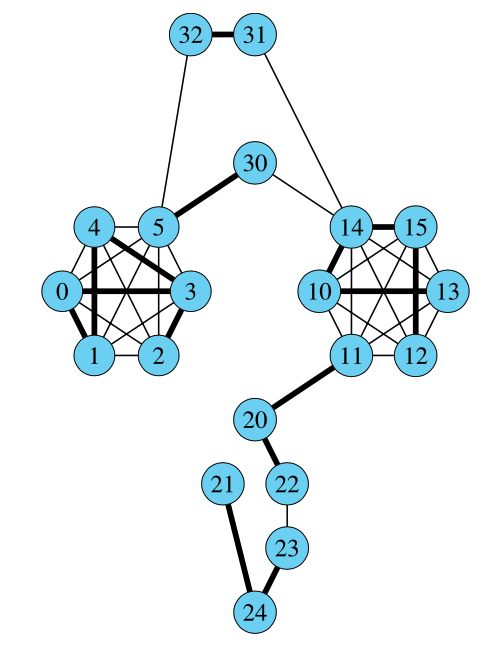

### Aufgabe 1
a)
bandwidth: Total amount of work done in a given time. 

* Maximum rate at which information can be transfered
* Aggregate bandwidth - total data bandwidth supplied by network
* Effective bandwidth - fraction of aggregate bandwidth delivered to an application

Latency: Time between start and completion of an event

Sending overhead + time of flight + (Packet size / Bandwidth) + receiving overhead \
b)
Bandwidth: Shared-media networks

Latency: Switched-media networks

### Aufgabe 2

| Kategorie | Ring | 2D-Mesh | 2D-Torus | Vollverbunden |
| --- | --- | --- | --- | --- |
| Bisection width | 2 | 8 |  16| 1024 |
| Anzahl der Verbindungen zwischen allen Switches |64 | 112 | 128 | 2016 |

### Aufgabe 3
 \

a) \
Diameter: 9 \
Knotenpaar: e.g. 1-21

Bisection Bandwidth: 300MB/s \
Group1: 0,1,2,3,4,5,21,23,24,30 \
Group2: 10,11,12,13,14,15,20,22,31,32 

Network Degree: 7 \
node: 5, 14

Node connectivity: 1 \
Node: 20 or 22 or 23 or 24 or 11 or 13 or 5

b) TODO 
1. Bisection bandwidth is too low(300 MB/s), but several links are 1 Gb/s, which means the throughput is low. 

2. Diameter is high, so that there is big distance for message transfer, which means high latency.

### Aufgabe 4
TODO

### Aufgabe 5
a) \
A thread includes: Thread ID, Program counter, Register set, Stack

b) 
1. Each process has its own address space, but threads in the same process share the address space.

2. For this reason, only inter-process communication is actually required. The threads of the same process share the address space. Synchronization/mutual exclusion is required to protect shared global variables.

3. The inter-process communication, whether it is a signal, a pipe, or a shared memory, is guaranteed by the operating system.

4. And network in Communication library also can be used for communication between different devices and processes.  E.g. Socket.

c) TODO

d) TODO